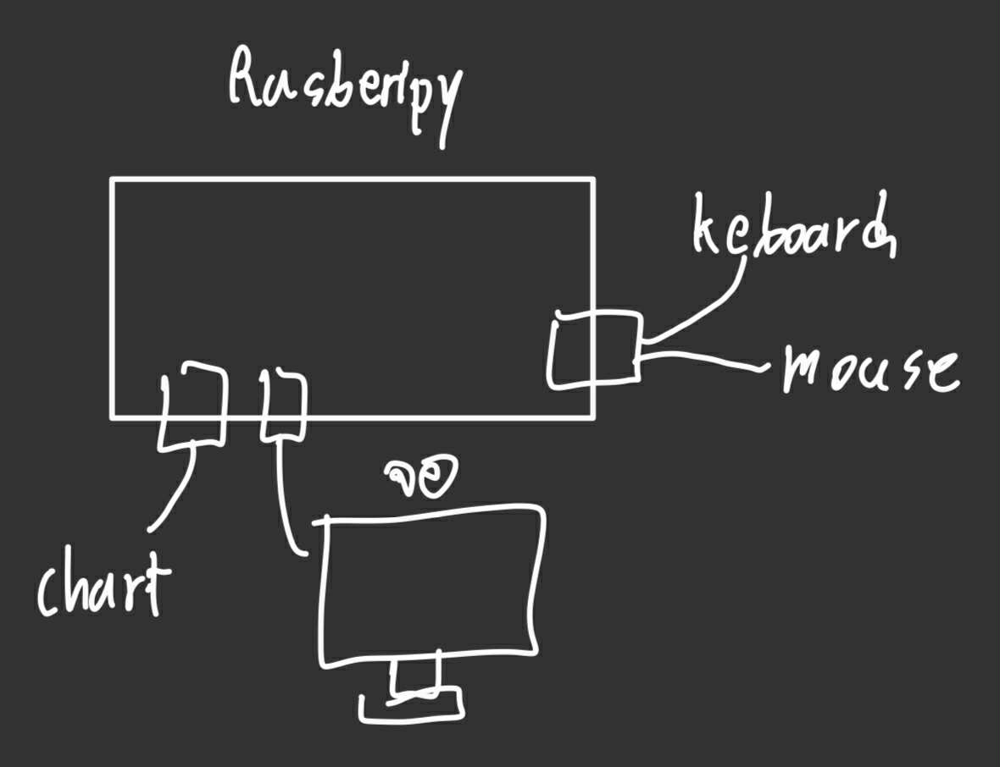
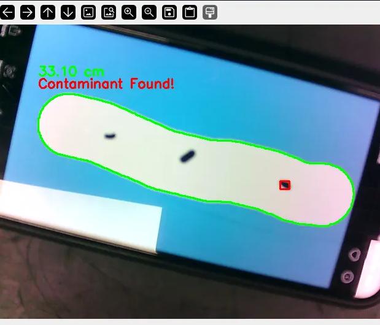
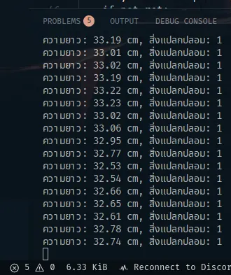

# FIBO CPRAM

## Project

### “พัฒนากระบวนการ ตรวจวัดคุณภาพแป้งขนมปังก่อนและหลังบ่ม (Proof) แบบอัตโนมัติ”

### วัตถุประสงค์

1. เพื่อทำงานซ้ำๆ
2. ออกแบบโดยใช้ image processing และ distance laser sensor
3. เพื่อวิเคราะห์คุณภาพก่อนหลังบ่ม

### **รายละเอียดเบื้องต้น**

1. ทำระบบตรวจวัดขนาดของแป้งขนมปังหลังคลึง,ตรวจสอบสิ่งแปลกปลอมโดยระบบกล้อง
2. ทำระบบตรวจสอบคุณภาพการบ่มโดยการวัดความสูงของแป้งก่อนและหลังบ่ม
3. ทำระบบจัดเก็บข้อมูลและแสดงผลผ่านรูปแบบกราฟ

---

## 14/10/2025

### **Research**

**ศึกษาการเลือกประเภทกล้องที่จะใช้ในโรงงานอุตสาหกรรม**

ถ้าเหมาะสมที่สุด กล้องประเภท Area Scan Camera
เนื่องจากเป็นแค่ตัว prototype จึงใช้ webcam

> ref:
****[facebook](https://www.facebook.com/wjtechnology/posts/%E0%B9%81%E0%B8%99%E0%B8%B0%E0%B8%99%E0%B8%B3-4-%E0%B8%9B%E0%B8%A3%E0%B8%B0%E0%B9%80%E0%B8%A0%E0%B8%97%E0%B8%81%E0%B8%A5%E0%B9%89%E0%B8%AD%E0%B8%87%E0%B8%AD%E0%B8%B8%E0%B8%95%E0%B8%AA%E0%B8%B2%E0%B8%AB%E0%B8%81%E0%B8%A3%E0%B8%A3%E0%B8%A1-%E0%B9%80%E0%B8%9E%E0%B8%A3%E0%B8%B2%E0%B8%B0%E0%B8%81%E0%B8%A5%E0%B9%89%E0%B8%AD%E0%B8%87%E0%B8%A7%E0%B8%B4%E0%B8%8A%E0%B8%B1%E0%B8%99%E0%B9%84%E0%B8%A1%E0%B9%88%E0%B9%84%E0%B8%94%E0%B9%89%E0%B8%A1%E0%B8%B5%E0%B9%81%E0%B8%84%E0%B9%88%E0%B9%81%E0%B8%9A%E0%B8%9A%E0%B9%80%E0%B8%94%E0%B8%B5%E0%B8%A2%E0%B8%A7%E0%B8%AA%E0%B8%B3%E0%B8%AB%E0%B8%A3%E0%B8%B1%E0%B8%9A%E0%B8%A3%E0%B8%B0%E0%B8%9A%E0%B8%9A-machi/1315760153891117/)
[machine vision](https://machinevision.co.th/technical-knowledge/%E0%B8%9B%E0%B8%A3%E0%B8%B0%E0%B9%80%E0%B8%A0%E0%B8%97%E0%B8%82%E0%B8%AD%E0%B8%87%E0%B8%81%E0%B8%A5%E0%B8%AD%E0%B8%87%E0%B9%83%E0%B8%99%E0%B8%A3%E0%B8%B0%E0%B8%9A%E0%B8%9A-machine-vision/)
> 

---

**Raspberry pi**

วิธีต่อ Raspberry Pi



> ref:
****[youtube](https://www.youtube.com/watch?v=SxkVLoiB7J4)
> 

---

**Opencv**

**ติดตั้ง opencv ลงใน rasberry pi**

- version เบื้องต้น

```bash
pip install  --upgrade pip
pip3 install --user imutils
pip3 install opencv-python
pip3 install opencv-contrib-python
pip3 install numpy
```

- version เต็ม
[Downloads](https://opencv.org/releases.html)

```bash
unzip
cd opencv
mkdir release
cd release
cmake -D CMAKE_BUILD_TYPE=RELEASE \> -D CMAKE_INSTALL_PREFIX=/usr/local ..
make
sudo make install
```

> ref:
****[medium](https://medium.com/@kewinrueangraklikhit/%E0%B8%95%E0%B8%B4%E0%B8%94%E0%B8%95%E0%B8%B1%E0%B9%89%E0%B8%87-opencv-%E0%B9%83%E0%B8%99-raspberry-pi-d396baf4748b)
> 

---

**Basic Command ที่ จะใช้**

```python
cv2.imread() #โหลดภาพเข้ามาในโค้ด
cv2.cvtColor() #แปลงภาพสีเป็นภาพสีเทา (Grayscale) เพื่อให้ง่ายต่อการประมวลผล
cv2.GaussianBlur() #ลด Noise หรือสัญญาณรบกวนในภาพ ทำให้ภาพเรียบเนียนขึ้น
cv2.threshold() #คำสั่งสำคัญที่สุด! ใช้เปลี่ยนภาพสีเทาเป็นภาพขาวดำ โดยกำหนดค่ากลาง (Threshold) เพื่อแยกวัตถุที่สนใจออกจากพื้นหลัง
cv2.findContours() #ค้นหาเส้นขอบ (Contour) ของวัตถุทั้งหมดในภาพขาวดำ
cv2.drawContours() #วาดเส้นขอบที่เราหาเจอลงบนภาพต้นฉบับเพื่อแสดงผล
cv2.contourArea() #คำนวณขนาดพื้นที่ของแต่ละ Contour ที่หาได้
```

> ref:
****[doc_open_cv](https://docs.opencv.org/3.4/d3/df2/tutorial_py_basic_ops.html)
> 

---

**MQTT**

**Esp32**

- เชื่อมต่อ MQTT ผ่านการใช้ Arduino IDE

```arduino
WiFiClient wifiClient //creates a Wi-Fi client.
MqttClient mqttClient(wifiClient) //connects the Wi-Fi client to the MQTT client.
WiFi.begin(ssid, pass) //connects to local Wi-Fi network.
mqttClient.connect(broker, port) //connects to broker (and port).
mqttClient.poll() //keeps the connection alive, used in the loop().
mqttClient.beginMessage(topic) //creates a new message to be published.
mqttClient.print() //prints the content of message between the ().
mqttClient.endMessage() //publishes the message to the broker.
mqttClient.subscribe(topic) //subscribes to a topic.
mqttClient.available() //checks if any messages are available from the topic.
mqttClient.read() //reads the incoming messages.
```

> ref:
****[arduino](https://docs.arduino.cc/tutorials/uno-wifi-rev2/uno-wifi-r2-mqtt-device-to-device/)
> 

**Raspberry**

- Import module

```python
import paho.mqtt.client as mqtt
host = “broker.mqttdashboard.com”
port = 8000
```

- Connect

```python
def on_connect(self, client, userdata, rc):
    print("MQTT Connected.")
    self.subscribe("TEST/MQTT")
```

- Send message

```python
def on_message(client, userdata,msg):
    print(msg.payload.decode("utf-8", "strict"))
```

- Connect and loop effort

```python
client = mqtt.Client()
client.on_connect = on_connect
client.on_message = on_message
client.connect(host)
client.loop_forever()
```

> ref:
****[medium](https://toomtamdn.medium.com/%E0%B8%81%E0%B8%B2%E0%B8%A3%E0%B9%83%E0%B8%8A%E0%B9%89%E0%B8%87%E0%B8%B2%E0%B8%99-python-%E0%B8%A3%E0%B9%88%E0%B8%A7%E0%B8%A1%E0%B8%81%E0%B8%B1%E0%B8%9A-mqtt-aea8549045e1)
> 

---

### **Plan Software**

**Process**


> ref
[youtube](https://www.youtube.com/watch?v=T2EMEJ2_4QU)
> 

---

**Algorithm**

Version 1


Version 2 เปลี่ยนเนื่องจาก “เข้าใจโจทย์ผิด”


---

### **Question**

- [ ]  ต้องการให้ส่งขเอมูลไปยัง Dashboard ตอนหลังบ่มเป็น result สุดท้ายว่ามีคุณภาพหรือไม่ทีเดียวเลย หรือต้องส่งข้อมูลทั้งก่อนบ่มและหลังบ่ม
- [ ]  Dashboard ที่เป็นกราฟต้องการแบบ 0/1 แนวแกน y และ timestamp ในแกน x เพื่อดูว่ามีอะไรขนมที่ไม่ได้คุณภาพอยู่ในสายพานใช่หรือไม่
- [ ]  ความสูงของขนมปังตอนเริ่มที่ยอมรับได้มีค่าเท่าไหร่
- [ ]  ความเร็วของสายพานเป็นเท่าไหร่

---

### **Progress Part of Software**

- Camera
    - [ ]  Raspberrypi : OpenCV
    - [ ]  Raspberrypi : MQTT
- Sensor 1
    - [ ]  MPU : receive data from sensor
    - [ ]  MPU : MQTT
- Sensor 2
    - [ ]  MPU : receive data from sensor
    - [ ]  MPU : MQTT
- Node-Red
    - [ ]  Sensor 1 : Receive status from Raspberrypi
    - [ ]  Sensor 1 : Receive data from MPU
    - [ ]  Sensor 1 : Paraphrase data
    - [ ]  Sensor 2 : Receive status from Raspberrypi
    - [ ]  Sensor 2 : Receive data from MPU
    - [ ]  Sensor 2 : Paraphrase data
    - [ ]  Send sensor 1 or sensor 2 to google form
- Google Sheet
    - [ ]  Google Form
    - [ ]  Template google sheet
    - [ ]  Auto fill raw data to template
    - [ ]  Calculate percentage of proof
- App Script
    - [ ]  Backend : get data from google sheet
    - [ ]  Frontend : Dashboard

---

## 15/10/2025

### **Google Sheet**

**Google Form**


---

**Template**


---

**Autofill**


```jsx
function sortDataOnChange(e) {
  const sourceSheetName = "Raw_data";
  const proofSheetName = "Proof_state";
  const rollSheetName = "Roll_state";

  const ss = SpreadsheetApp.getActiveSpreadsheet();
  const sourceSheet = ss.getSheetByName(sourceSheetName);

  const lastRow = sourceSheet.getLastRow();
  const timestamp = sourceSheet.getRange(lastRow, 1).getValue();
  const module = sourceSheet.getRange(lastRow, 2).getValue();
  const data = sourceSheet.getRange(lastRow, 3).getValue();

  if (module === 'sensor1') {
    const destSheet = ss.getSheetByName(proofSheetName);
    const lastDestRow = destSheet.getLastRow();
    let targetRow = 0;
    for (let i = 2; i <= lastDestRow + 1; i++) {
      if (destSheet.getRange(i, 3).getValue() === "") {
        targetRow = i;
        break;
      }
    }
    destSheet.getRange(targetRow, 2).setValue(timestamp);
    destSheet.getRange(targetRow, 3).setValue(data);

  } else if (module === 'sensor2') {
    const destSheet = ss.getSheetByName(proofSheetName);
    const lastDestRow = destSheet.getLastRow();
    let targetRow = 0;
    for (let i = 2; i <= lastDestRow + 1; i++) {
      if (destSheet.getRange(i, 5).getValue() === "") {
        targetRow = i;
        break;
      }
    }
    destSheet.getRange(targetRow, 4).setValue(timestamp);
    destSheet.getRange(targetRow, 5).setValue(data);

  } else if (module === 'cam') {
    const camRawData = String(data);
    const camData = camRawData.split(',');
    const length = camData[0];
    Logger.log(length);
    const status = camData[1];
    Logger.log(status);

    const destSheet = ss.getSheetByName(rollSheetName);
    const lastDestRow = destSheet.getLastRow();
    let targetRow = 0;
    for (let i = 2; i <= lastDestRow + 1; i++) {
      if (destSheet.getRange(i, 2).getValue() === "") {
        targetRow = i;
        break;
      }
    }
    destSheet.getRange(targetRow, 2).setValue(timestamp);
    destSheet.getRange(targetRow, 3).setValue(length);
    destSheet.getRange(targetRow, 4).setValue(status);
  }
}

```

google sheet สามารถรับ data จาก google form และส่ง data ไปยัง sheet ที่ต้องการได้แล้ว

---

### **Sensor 1 and Sensor 2**

**Receive data from the sensor**

[VL53L1X.ino](source/VL53L1X.ino)

โค้ดสำหรับวัด sensor เสร็จแล้วแต่ยังไม่ได้ทดสอบ

---

**MQTT**

[MQTT.ino](source/MQTT.ino)

esp32 สามารถส่งข้อมูลแบบ mqtt ได้แล้ว

---

### **Node-Red**


รับข้อมูลจาก mqtt และส่งข้อมูลไปยัง google sheet ได้แล้ว

---

### **Progress Part of Software**

- Camera
    - [ ]  Python: OpenCV
    - [ ]  Python: MQTT
- Sensor 1
    - [x]  MPU: receive data from the sensor
    - [x]  MPU: MQTT
- Sensor 2
    - [x]  MPU: receive data from the sensor
    - [x]  MPU: MQTT
- Node-Red
    - [ ]  Camera: Receive data from the Laptop
    - [x]  Sensor 1: Receive data from MPU
    - [ ]  Sensor 1: Paraphrase data
    - [x]  Sensor 2: Receive data from MPU
    - [ ]  Sensor 2: Paraphrase data
    - [x]  Send camera or sensor 1 and sensor 2 to the Google Form
- Google Sheet
    - [x]  Google Form
    - [x]  Template Google Sheet
    - [x]  Auto-fill raw data to template
    - [ ]  Calculate the percentage of proof
- App Script
    - [ ]  Backend: get data from Google Sheet
    - [ ]  Frontend: Dashboard

---

## 16/10/2025

### Tour

**Question**

1. ตอนนี้ใช้วิธีตรวจสอบยังไง
part หลังคลึงใช้ เครื่องจักร
part หลังบ่มใช้คนสุ่มตรวจ
2. การตรวจวัดขนาดของแป้งหลังคลึง ต้องการค่าอะไรบ้าง
ความยาว 40 - 50 cm.
สิ่งปนเปื้อน
3. การวัดคุณภาพการบ่ม ต้องวัดอะไรบ้าง
ความสูง เวอร์เนียวัด
4. การวัดการขึ้นฟูหลังการบ่ม ค่าที่ยอมรับอยู่ในช่วงไหน
เค้าบอกว่า 4.5 - 5 cm.(เลขสมมุติ) ขึ้นจากกรอบกล่อง
5. ขั้นตอนการทำความสะอาดในสายการผลิตมีการทำอะไรบ้าง
แล้วแต่เครื่องจัก เครื่องจักรบางอัน 1 สัปดาห์ บางอัน 1เดือน
6. มีการสเปรย์หรือเคลือบน้ำมันในบล็อคหรือโดไหม
ไม่มี

---

### **Node-Red**


สามารถ paraphase ข้อมูลได้แล้ว

---

### **Presentation**

จัดทำไสล์ใหม่ โดยเรียงหัวข้อแบบนี้

**Bread → Project → Hardware → Software**

---

### **Progress Part of Software**

- Camera
    - [ ]  Python: OpenCV
    - [ ]  Python: MQTT
- Sensor 1
    - [x]  MPU: receive data from the sensor
    - [x]  MPU: MQTT
- Sensor 2
    - [x]  MPU: receive data from the sensor
    - [x]  MPU: MQTT
- Node-Red
    - [ ]  Camera: Receive data from the Laptop
    - [x]  Sensor 1: Receive data from MPU
    - [x]  Sensor 1: Paraphrase data
    - [x]  Sensor 2: Receive data from MPU
    - [x]  Sensor 2: Paraphrase data
    - [x]  Send camera or sensor 1 and sensor 2 to the Google Form
- Google Sheet
    - [x]  Google Form
    - [x]  Template Google Sheet
    - [x]  Auto-fill raw data to template
    - [x]  Calculate the percentage of proof
- App Script
    - [ ]  Backend: get data from Google Sheet
    - [ ]  Frontend: Dashboard

---

## 17/10/2025

### **Camera**

Opencv





opencv สามารถวัดความยาวแป้งโด และตรวจจับสิ่งแปลกปลอมได้

[Combine_Opencv.py](source/Combine_Opencv.py)

---

MQTT


opencv สามารถส่งค่าไปยัง Node red ได้

---

### **App Script**


Dashboard เสร็จแล้ว

---

### **Progress Part of Software**

- Camera
    - [x]  Python: OpenCV
    - [x]  Python: MQTT
- Sensor 1
    - [x]  MPU: receive data from the sensor
    - [x]  MPU: MQTT
- Sensor 2
    - [x]  MPU: receive data from the sensor
    - [x]  MPU: MQTT
- Node-Red
    - [x]  Camera: Receive data from the Laptop
    - [x]  Sensor 1: Receive data from MPU
    - [x]  Sensor 1: Paraphrase data
    - [x]  Sensor 2: Receive data from MPU
    - [x]  Sensor 2: Paraphrase data
    - [x]  Send camera or sensor 1 and sensor 2 to the Google Form
- Google Sheet
    - [x]  Google Form
    - [x]  Template Google Sheet
    - [x]  Auto-fill raw data to template
    - [x]  Calculate the percentage of proof
- App Script
    - [x]  Backend: get data from Google Sheet
    - [x]  Frontend: Dashboard

---

## 18/10/2025

### **Camera**

แก้ไขระบบตรวจจับสิ่งแปลกปลอม


ภาพดินน้ำมันแทนแป้งโด มีสิ่งแปลกปลอม


ภาพดินน้ำมันแทนแป้งโด ไม่มีสิ่งแปลกปลอม

[Combine.ipynb](source/Combine.ipynb)

---

### **Research**

**Numerical method**

การแระมาณค่าเพื่อหาค่าที่แท้จริง ดีกว่าค่าเฉลี่ย ใช้
**FEA**

การหา surface ไม่ใช้

---

### **Progress Part of Software**

- Camera
    - [x]  Python: OpenCV
    - [x]  Python: MQTT
- Sensor 1
    - [x]  MPU: receive data from the sensor
    - [x]  MPU: MQTT
- Sensor 2
    - [x]  MPU: receive data from the sensor
    - [x]  MPU: MQTT
- Node-Red
    - [x]  Camera: Receive data from the Laptop
    - [x]  Sensor 1: Receive data from MPU
    - [x]  Sensor 1: Paraphrase data
    - [x]  Sensor 2: Receive data from MPU
    - [x]  Sensor 2: Paraphrase data
    - [x]  Send camera or sensor 1 and sensor 2 to the Google Form
- Google Sheet
    - [x]  Google Form
    - [x]  Template Google Sheet
    - [x]  Auto-fill raw data to template
    - [x]  Calculate the percentage of proof
- App Script
    - [x]  Backend: get data from Google Sheet
    - [x]  Frontend: Dashboard

---

## 19/10/2025

### **Algorithm**

แก้ Algorithm การวัดค่า


---

## 20/10/2025

### **Opencv**

แก้ rule base การตรวจจับภาพใน opencv ทั้งหมด


เอา noise ด้วย GaussianBlur


แปลงเป็นภาพ HSV


ทำ mask โดยดึงแค่สีขาวออกมา แล้วใช้ morphology Open กับ Close เพื่อเอา noise ออก


วัดขนาดและตรวจจับสีดำใน contour ของเรา

---

## 21/10/2025

### **Research**

**การวัดภาพ**


วัดความยาวด้วยการบีบเส้นวัดเส้นรอบรูป
วัดความกว้างด้วยหาระยะทางสั้นสุดระหว่าง skelet กับ contour

> ref:
****[stackoverflow](https://stackoverflow.com/questions/68918746/determine-thickness-head-and-tail-of-a-snake-in-opencv-c)
> 

**วิธีการ filter ในรูปแบบต่างๆ**


---

### **Algorithm**

**สร้าง algorithm ในการวัดความสูง**


---

## 22/10/2025

### **Algorithm**

**ทดสอบ algorithm**


ได้ใช้ Moving Average + Max

---

### **Measure**

เขียน algorithm การวัด


---

### **Progress Part of Software**

**เปลี่ยน Part of Software**


- Camera
    - [x]  Python: OpenCV
    - [x]  Python: MQTT
- Sensor 1
    - [x]  MPU: receive data from the sensor
    - [x]  MPU: MQTT
- Sensor 2
    - [x]  MPU: receive data from the sensor
    - [x]  MPU: MQTT
- Node-Red
    - [x]  Camera: Receive data from the Laptop
    - [x]  Sensor 1: Receive data from MPU
    - [x]  Sensor 1: Paraphrase data
    - [x]  Sensor 2: Receive data from MPU
    - [x]  Sensor 2: Paraphrase data
    - [x]  Send camera or sensor 1 and sensor 2 to the InfluxDB
- InfluxDB
    - [x]  Connect with Node-Red
- Grafana
    - [x]  Create Dashboard

**Node-Red**


**InfluxDB**


**Grafana**


---

## 23/10/2025

### **ESP32 and Node-red**

แก้จากการใช้ mosquito Broker ไปใช้ local broker จาก EMQX

---

### **Experiment**

ทดลองความแม่นยำของ algorithm part ของการวัดความสูงหลังบ่ม

---

## 24/10/2025

### **ESP32 and Node-red**

นำ Algorithm ไปใส่ใน ESP32 แทนและให้ส่งค่าที่เป็นข้อมูลจาก Algorithm เลยไม่ต้องไปคำนวนอีกรอบ


---

### **Opencv**

แก้จากการเอาข้อมูลทั้งหมดมาคำนวนเป็น capture 3 จุดแล้วหาค่าเฉลี่ย


---

### **Algorithm**

เพิ่ม sampling จาก 5 เป็น 30


---

### **Experiment**

ทดลองความแม่นยำของ algorithm part ของการตรวจจับสิ่งแปลกปลอม และการวัดขนาดหลังคลึง

---

## 25/10/2025

### **Node-red and Grafana**

เพิ่มการนับจำนวนขนมปังทั้งหมดและขนมปังที่เสีย พร้อมระบบ reset ทุกวัน


---

## 25/10/2025

### **Presentation**

แก้สไลด์ และนำเสนออาจารย์
